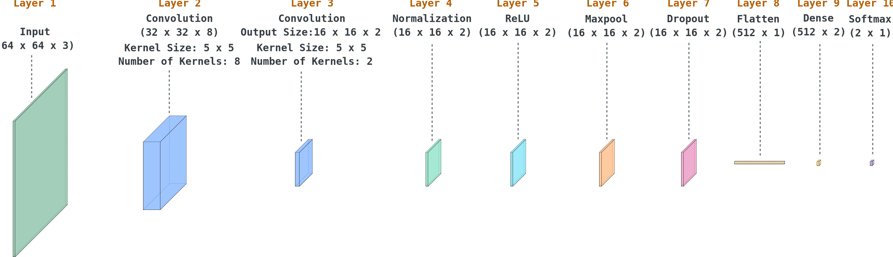

<div style="color:#0d6efd;">
    <h1>Hybrid Multi-Objective Neural Architecture Search for Lightweight Patch-Based Mistletoe Classification in UAV Imagery.</h1>
</div>

<p>
This repository contains the data and workspace for testing a lightweight Convolutional Neural Network (CNN) model designed for mistletoe classification. The model consists of <b>2040 trainable parameters</b> involving:
</p>
<ul>
    <li>Convolutional layers for feature extraction</li>
    <li>Batch normalization and ReLU activation functions</li>
    <li>Dropout for regularization</li>
    <li>Softmax output layer for classification</li>
</ul>

<p style="margin-top: 32px;">
    The model architecture is as follows:
</p>

<p style="margin-top: 32px;">
    The Matlab code to build the previous model is as follows:
</p>

## Directory Structure
<table>
    <tbody>
        <tr>
            <td style="display: flex; align-items: center;">
                
                <span style="font-weight: bold; margin-left: 8px;">imagedb</span>
            </td>
            <td>
                <p>
                    Contains the image database used for   testing of the CNN model.
                </p>
            </td>
        </tr>
        <tr>
            <td style="display: flex; align-items: center;">
                
                <span style="font-weight: bold; margin-left: 8px;">img</span>
            </td>
            <td>
                <p>Contains the images and icons used for this page.</p>
            </td>
        </tr>
        <tr>
            <td style="display: flex; align-items: center;">
                
                <span style="font-weight: bold; margin-left: 8px;">matlab</span>
            </td>
            <td>
                <p>Contains Matlab scripts ready-to-run to replicate results. You do not need to modify anything. Only download this repository and open the files in a Matlab R2025B+ environment to run them.</p>
            </td>
        </tr>
    </tbody>
</table>

## Authors
<ul>
    <li>
        Miguel Angel Gil Rios, 
        <a href="mailto:mgil@utleon.edu.mx">mgil@utleon.edu.mx</a>, 
        <a href="https://orcid.org/0000-0002-4829-6854">ORCID</a>
    </li>
    <li>
        Nivia Iracemi Escalante Garcia
        <a href="nivia.eg@pabellon.tecnm.mx">nivia.eg@pabellon.tecnm.mx</a>, 
        <a href="https://orcid.org/0000-0003-2688-6519">ORCID</a>
    </li>
    <li>
        Juan Carlos Valdiviezo Navarro, 
        <a href="mailto:jvaldiviezo@centrogeo.edu.mx">jvaldiviezo@centrogeo.edu.mx</a>, 
        <a href="https://orcid.org/0000-0001-6762-6233">ORCID</a></li>
    <li>
        Paola Andrea Mejía Zuluaga, 
        <a href="mailto:pmejia@centrogeo.edu.mx">pmejia@centrogeo.edu.mx</a>
        <a href="https://orcid.org/0000-0001-6075-4419">ORCID</a></li>        
    </li>
    <li>
        Le&oacute;n Dozal, 
        <a href="mailto:leon.dozal@gmail.com">leon.dozal@gmail.com</a>
        <a href="https://orcid.org/0000-0003-1347-8209">ORCID</a></li>        
    </li>
    <li>
        Ivan Cruz Aceves, 
        <a href="mailto:ivan.cruz@cimat.mx">ivan.cruz@cimat.mx</a>, 
        <a href="https://orcid.org/0000-0002-5197-2059">ORCID</a>
    </li>
</ul>


### If you use this material, please reference us as following:
#### AC S Style
Gil-Rios, M.-A.; Escalante-Garcia, N.; Valdiviezo-Navarro, J.; Mejia-Zuluaga, P.; Dozal, L.; Cruz-Aceves, I. Hybrid Multi-Objective Neural Architecture Search for Lightweight Patch-Based Mistletoe Classification in UAV Imagery. Journal of Imaging 2026, 12, 281. https://doi.org/10.3390/jimaging12070281

#### APA Style
Gil-Rios, M.-A., Escalante-Garcia, N., Valdiviezo-Navarro, J., Mejia-Zuluaga, P., Dozal, L., Cruz-Aceves, I. (2026). Hybrid Multi-Objective Neural Architecture Search for Lightweight Patch-Based Mistletoe Classification in UAV Imagery. Journal of Imaging 2026, 19, 47. https://doi.org/10.3390/jimaging12070281

#### BibTEx
```
@Article{Gil2026,
    title = {Hybrid Multi-Objective Neural Architecture Search for Lightweight Patch-Based Mistletoe Classification in UAV Imagery},
    author = {Gil-Rios, Miguel-Angel and Escalante-Garcia, Nivia and Valdiviezo-Navarro, Juan C. and Mejia-Zuluaga, Paola Andrea and Dozal, León and Cruz-Aceves, Ivan},
    journal = {Journal of Imaging},
    volume = {12},
    year = {2026},
    article-number = {281},
    url = {https://www.mdpi.com/2313-433X/12/7/281},
    issn = {2313-433X},
    doi = {10.3390/jimaging12070281}
}
```
